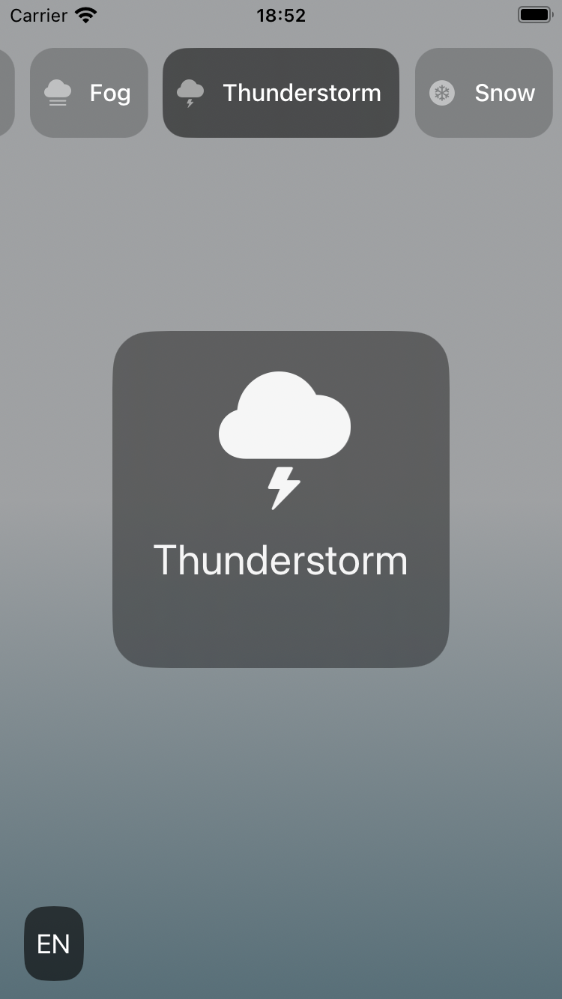

# VK internship assignment

### Task
Create a weather-inspired app with animated collection with different weather events with the ability to switch the language of the app.

### Stack
- iOS 14+ (UIKit)
- MVP + Router
- No dependencies

### Features
- Getting random weather event on every start
- Animated horizontal menu
- Animated full screen weather event view via custom collection view
- Animated gradient background
- Localization between English and Russian languages via settings (apple preferred way)
- Adaptive design

### Demo

- Adaptive design  

- Main flow  

- Localization  
